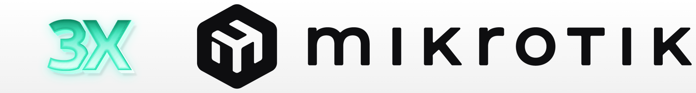

# :sparkles: XRay + MikroTik :sparkles:



Код написан на базе репозитория [catesin/Xray-vless-reality-MikroTik](https://github.com/catesin/Xray-vless-reality-MikroTik) — оттуда взяты схема настройки RouterOS и подход с контейнером. Спасибо автору за исходную работу.

В данном репозитории рассматривается работа MikroTik RouterOS V7.22+ с протоколом **XRay**. В процессе настройки, относительно вашего оборудования, следует выбрать вариант реализации с [контейнером](https://help.mikrotik.com/docs/display/ROS/Container) внутри RouterOS. 

Предполагается что вы уже настроили серверную часть Xray например [с помощью панели управления 3x-ui](https://github.com/MHSanaei/3x-ui) и протестировали конфигурацию клиента, например на смартфоне или персональном ПК.

:school: Внимание! Инструкция среднего уровня сложности. Перед применением настроек вам необходимо иметь опыт в настройке MikroTik уровня сертификации MTCNA. 

В репозитории есть инструкция по использованию [готового](https://hub.docker.com/r/naumso/docker-xray-vless) контейнера и всё необходимое для самостоятельной сборки (`Dockerfile`, `Makefile`, каталог `scripts`). Образ собирается сразу под три архитектуры — **ARM, ARM64 и x86**.

:octocat: **Исходники:** [github.com/naumso/xray-mikrotik](https://github.com/naumso/xray-mikrotik)

:whale: **Официальный образ:** [hub.docker.com/r/naumso/docker-xray-vless](https://hub.docker.com/r/naumso/docker-xray-vless)

В RouterOS он подключается параметром `remote-image=naumso/docker-xray-vless:latest`, вручную скачивается как:
```
docker pull naumso/docker-xray-vless:latest
```
Кроме `:latest` публикуются теги по версии Xray, например `:26.7.28` — их удобно использовать, чтобы зафиксировать версию.

------------

* [Преднастройка RouterOS](#Pre_edit)
* [Настройка RouterOS с контейнером](#R_Xray)
	- [Готовые контейнеры](#R_Xray_build_ready)
	- [Команды make](#R_Xray_make)
	- [Настройка контейнера в RouterOS](#R_Xray_settings)	
* [Лицензия](#License)

------------

<a name='Pre_edit'></a>
## Преднастройка RouterOS

Создадим отдельную таблицу маршрутизации:
```
/routing table 
add disabled=no fib name=to_vpn
```
Добавим address-list "to_vpn" что бы находившиеся в нём IP адреса и подсети заворачивать в пока ещё не созданный туннель
```
/ip firewall address-list add address=www.myip.com list=to_vpn
```
Добавим address-list "RFC1918" что бы не потерять доступ до RouterOS при дальнейшей настройке
```
/ip firewall address-list
add address=10.0.0.0/8 list=RFC1918
add address=172.16.0.0/12 list=RFC1918
add address=192.168.0.0/16 list=RFC1918
```

Добавим правила в mangle для address-list "RFC1918" и переместим его в самый верх правил
```
/ip firewall mangle
add action=accept chain=prerouting dst-address-list=RFC1918 in-interface-list=!WAN
```

Добавим правило транзитного трафика в mangle для address-list "to_vpn"
```
/ip firewall mangle
add action=mark-connection chain=prerouting connection-mark=no-mark dst-address-list=to_vpn in-interface-list=!WAN \
    new-connection-mark=to_vpn passthrough=yes
```
Добавим правило для транзитного трафика отправляющее искать маршрут до узла назначения через таблицу маршрутизации "to_vpn", созданную на первом шаге
```
add action=mark-routing chain=prerouting connection-mark=to_vpn in-interface-list=!WAN new-routing-mark=to_vpn \
    passthrough=yes
```
Маршрут по умолчанию в созданную таблицу маршрутизации "to_vpn" добавим чуть позже.

:exclamation:Два выше обозначенных правила будут работать только для трафика, проходящего через маршрутизатор. 
Если вы хотите заворачивать трафик, генерируемый самим роутером (например команда ping 172.217.168.206 c роутера для проверки туннеля в контейнере), тогда добавляем ещё два правила (не обязательно). 
Они должны находиться по порядку, следуя за вышеобозначенными правилами.
```
/ip firewall mangle
add action=mark-connection chain=output connection-mark=no-mark \
    dst-address-list=to_vpn new-connection-mark=to-vpn-conn-local \
    passthrough=yes
add action=mark-routing chain=output connection-mark=to-vpn-conn-local \
    new-routing-mark=to_vpn passthrough=yes
```

------------
<a name='R_Xray'></a>
## Настройка RouterOS с контейнером

### RouterOS с контейнером

Данный пункт настройки подходит только для устройств с архитектурой **ARM, ARM64 или x86**. 
Перед запуском контейнера в RouteOS убедитесь что у вас [включены контейнеры](https://help.mikrotik.com/docs/spaces/ROS/pages/84901929/Container). 
С полным списком поддерживаемых устройств можно ознакомится [тут](https://mikrotik.com/products/matrix). 

:warning: Предполагается что на устройстве (или если есть USB порт с флешкой) имеется +- 120 Мбайт свободного места для разворачивания контейнера внутри RouterOS. Сам контейнер весит около 85 Мбайт в распакованном виде (основное — бинарники xray ~35 Мбайт и tun2socks ~10 Мбайт), точный размер немного зависит от архитектуры. Если места не хватает, его можно временно расширить [за счёт оперативной памяти](https://help.mikrotik.com/docs/spaces/ROS/pages/91193346/Disks#Disks-AllocateRAMtofolder). После перезагрузки RouterOS, всё что находится в RAM, стирается. 

### Включение функции контейнеров в RouterOS

Основная инструкция по включению функции контейнеров находится [ТУТ](https://help.mikrotik.com/docs/spaces/ROS/pages/84901929/Container#Container-Summary) или [ТУТ](https://www.google.com/search?q=%D0%9A%D0%B0%D0%BA+%D0%B2%D0%BA%D0%BB%D1%8E%D1%87%D0%B8%D1%82%D1%8C+%D0%BA%D0%BE%D0%BD%D1%82%D0%B5%D0%B9%D0%BD%D0%B5%D1%80%D1%8B+%D0%B2+mikrotik&oq=%D0%BA%D0%B0%D0%BA+%D0%B2%D0%BA%D0%BB%D1%8E%D1%87%D0%B8%D1%82%D1%8C+%D0%BA%D0%BE%D0%BD%D1%82%D0%B5%D0%B9%D0%BD%D0%B5%D1%80%D1%8B+%D0%B2+mikrotik)

Порядок действий выглядит так: 

* Обновляемся до последней версии RouterOS
* Скачиваем дополнительный пакет из расширений "all packages" на [официальном сайте](https://mikrotik.com/download)
* Устанавливаем пакет
* Включаем функцию контейнеров

<a name='R_Xray_build_ready'></a>
### Готовые контейнеры

**Где взять контейнер?** Его можно собрать самому из текущего репозитория или скачать готовый образ под выбранную архитектуру из [Docker Hub](https://hub.docker.com/r/naumso/docker-xray-vless).
Скачав готовый образ [переходим сразу к настройке](#R_Xray_settings).

Для самостоятельной сборки понадобятся подсистема Docker [buildx](https://github.com/docker/buildx?tab=readme-ov-file) и "make". Бинарники xray и tun2socks скачиваются готовыми из релизов, собирать их не нужно.

В текущем примере будем собирать на MacOs:
1) Скачиваем [Docker Desktop](https://docs.docker.com/desktop/) и устанавливаем
2) Скачиваем этот репозиторий например через [GitHub Desktop](https://desktop.github.com/download/)
3) Открываем папку репозитория в терминале
4) Запускаем Docker с ярлыка на рабочем столе (окно приложения должно просто висеть в фоне при сборке) и через cmd собираем контейнер под выбранную архитектуру RouterOS
5) Дальше есть два пути.

**Собрать в файл** и потом закинуть .tar в RouterOS — выбираем цель под свою архитектуру:

- ARMv8 (arm64/v8) `make build-to-file-arm64` — спецификация 8-го поколения оборудования ARM, которое поддерживает архитектуры AArch32 и AArch64.
- ARMv7 (arm/v7) `make build-to-file-arm` — спецификация 7-го поколения оборудования ARM, которое поддерживает только архитектуру AArch32. 
- AMD64 (amd64) `make build-to-file-amd64` — это 64-битный процессор, который добавляет возможности 64-битных вычислений к архитектуре x86

**Либо опубликовать в свой Docker Hub** — создать в корне проекта файл `.env.local` со строкой `DOCKERHUB_REPO=имя_вашего_пользователя` (без кавычек — файл читается синтаксисом make, кавычки попадут внутрь значения) и выполнить `make build-push-docker`. Соберутся и запушатся сразу все три архитектуры.

<a name='R_Xray_make'></a>
### Команды make

|             Команда            |                                        Что делает                                        |
|--------------------------------|------------------------------------------------------------------------------------------|
| `make build-to-file-arm64`     | Собирает под linux/arm64 и складывает образ в `docker-xray-vless-arm64.tar`                |
| `make build-to-file-arm`       | То же под linux/arm (ARMv7) → `docker-xray-vless-arm.tar`                                  |
| `make build-to-file-amd64`     | То же под linux/amd64 → `docker-xray-vless-amd64.tar`                                      |
| `make build-push-docker`       | Собирает сразу три архитектуры и пушит в Docker Hub. Требует `DOCKERHUB_REPO`              |
| `make build-push-private`      | То же, но в приватный реестр. Требует `PRIVATE_REPO`                                       |
| `make test`                    | Собирает образ локально и бросает вас в шелл внутри контейнера. Требует `TEST_URL`         |

Полученный `.tar` заливается в RouterOS через Files и разворачивается параметром `file=` вместо `remote-image=`.

Сборки в файл идут с `--no-cache`, то есть каждый раз с нуля. Пуш-цели кэш используют и вешают сразу два тега — `:latest` и `:<версия Xray>` из переменной `XRAY_VERSION` в `Makefile`.

**Версия Xray** задаётся в `Makefile` строкой `XRAY_VERSION` и передаётся в сборку. Значение в `Dockerfile` — только запасное, на случай прямого `docker build` без аргументов; при обновлении держите их одинаковыми. Разово можно собрать другую версию не правя файл: `make build-to-file-arm64 XRAY_VERSION=26.8.1`.

**`make test`** монтирует локальный каталог `scripts` в `/opt/develop`, поэтому правки скриптов подхватываются без пересборки образа. Контейнер запускается с `--privileged` — иначе не поднять tun-интерфейс. Внутри туннель поднимается вручную:

```
/bin/sh /opt/develop/start.sh
```

#### Файлы `.env` и `.env.local`

Обе цели-пуша и `make test` берут настройки из двух файлов в корне репозитория:

* **`.env`** — общие значения, лежит в репозитории;
* **`.env.local`** — ваши личные значения, в `.gitignore`, перекрывает `.env`.

Значения из командной строки перекрывают оба: `make test TEST_URL=https://...`.

|      Переменная      |                              Назначение                              |
|----------------------|----------------------------------------------------------------------|
| **TEST_URL**         | строка подключения или ссылка на подписку для `make test`            |
| **TEST_XRAY_XMUX**   | JSON мультиплексирования для `make test` (пусто — выключено)         |
| **DOCKERHUB_REPO**   | пользователь Docker Hub для `make build-push-docker`                 |
| **PRIVATE_REPO**     | адрес приватного реестра для `make build-push-private`               |

Оба файла целиком пробрасываются в контейнер при `make test`, поэтому туда же можно положить любые переменные самого контейнера — `SOCKS_PORT`, `TUN_IP`, `CHECK_URL`, `LOCAL_NETS`, `IGNORE_RFC_PRIVATE_NETS`.

Формат — синтаксис make, а не shell: значения без кавычек, `#` начинает комментарий, `$` пишется как `$$`.

Если обязательная переменная не задана, цель падает сразу с подсказкой, а не в середине сборки:

```
ERROR: DOCKERHUB_REPO не задан.
Задайте его в .env (общее) или .env.local (личное, перекрывает .env):
    DOCKERHUB_REPO=myuser
или передайте напрямую: make <цель> DOCKERHUB_REPO=...
```

<a name='R_Xray_settings'></a>
### Настройка контейнера в RouterOS

В текущем примере на устройстве MikroTik флешки нет. Хранить будем всё в корне.
Если у вас есть USB порт и флешка, лучше размещать контейнер на ней.  Можно комбинировать память загрузив контейнер в расшаренный диск [за счёт оперативной памяти](https://www.youtube.com/watch?v=uZKTqRtXu4M), а сам контейнер разворачивать в постоянной памяти.

Рекомендую создать пространство из ОЗУ хотя бы для tmp директории. Размер регулируйте самостоятельно:
```
/disk
add slot=ramstorage tmpfs-max-size=100M type=tmpfs
```

:exclamation:**Если контейнер не запускается на флешке.**
Например, вы хотите разместить контейнер в каталоге /usb1/docker/xray. Не создавайте заранее каталог xray на USB-флеш-накопителе. При создании контейнера добавьте в команду распаковки параметр "root-dir=usb1/docker/xray", в этом случае контейнер распакуется самостоятельно создав каталог /usb1/docker/xray и запустится без проблем.

**В RouterOS выполняем:**

0) Подключим Docker HUB в наш RouterOS

```
/container config set tmpdir=ramstorage

/container/config/set registry-url=https://registry-1.docker.io tmpdir=/ramstorage
```

1) Создадим интерфейс для контейнера
```
/interface veth add address=172.18.20.6/30 gateway=172.18.20.5 gateway6="" name=docker-xray-vless-veth
```

2) Добавим правило в mangle для изменения mss для трафика, уходящего в контейнер. Поместите его после правила с RFC1918 (его мы создали ранее).
```
/ip firewall mangle add action=change-mss chain=forward new-mss=1360 out-interface=docker-xray-vless-veth passthrough=yes protocol=tcp tcp-flags=syn tcp-mss=1420-65535
```

3) Назначим на созданный интерфейс IP адрес. IP 172.18.20.6 возьмёт себе контейнер, а 172.18.20.5 будет адрес RouterOS.
```
/ip address add interface=docker-xray-vless-veth address=172.18.20.5/30
```
4) В таблице маршрутизации "to_vpn" создадим маршрут по умолчанию ведущий на контейнер
```
/ip route add distance=1 dst-address=0.0.0.0/0 gateway=172.18.20.6 routing-table=to_vpn
```
5) Включаем masquerade для всего трафика, уходящего в контейнер.
```
/ip firewall nat add action=masquerade chain=srcnat out-interface=docker-xray-vless-veth
```
6) Создадим список переменных окружения envs под названием "xray", который позже при запуске будем передавать в контейнер.
Параметры подключения Xray вы должны взять из сервера панели 3x-ui. 

:anger: Пример импортируемой строки из 3x-ui раздела клиента "Details" (у вас настройки должны быть сгенерированы свои):
```
vless://62878542-8f68-42f0-8c66-e5a46e9c2cb1@mydomain.com:443?type=tcp&encryption=none&security=reality&pbk=7JTFIDt3Eyihq723jpp564DnK8X_GHLs_jHjLrRMFng&fp=chrome&sni=google.com&sid=aeb4c72f73a05af2&spx=%2F&pqv=LjRcyvTpvdwE2DV-s7rUGVotLw1LNHH3cPCHnBlRXgJ7aGpImVv-axSQhotFbEcQfm_VQgEMzoLvzFlv9gFj8vWpsiDRqPYmDzs_3ZsTNJVx-X9dmrXuqMvenoEw-wc5OtITk5kOTks62ipPkem3ZX4aLzhNH9BhK-H4XE3nJybcpNc3yOBH1OwOBDV6OnpDXexqsbxuCJPBoUgW8TY8hW5GqSHKs7hg1sSegM_App-CLjMhnL3_u3T41B7pbI0ScRj63wLT9oz_i3DxoMHiz1o57XkxUTvS3f-YoFlUhs6LHXCeEwDU1TRkd-tQuNx3xK1fMbgxaK-Tk2YVD25L7-eWEOiZ2yiED_kRIZWH-1TjEPSvB9rIPYBlQTUxa4T4zIkbnCRDStu4nx4mqJg2cAFQqJXAmuyKGyuTEHBqPLJSpnQJ1es9BFCDEEXstkD3vzVBDpFNl0DZcTh9yDFMz7WDSX5LGuwOkywKhvSXBUG42ZtWpZVkFnGJmRIkkvs8-LoY1AvbVy52ylhSvfDsjIk6WeKhyBRfT5WRhWfO5rUdQeN8c8gD7WMTqCLAci1QChXLQRleD8irni1a-40C4h1UNWFBCj8MrZw8O9k5jxIvoVFyTOxkeepv_Ll8Pb6lb4qeO0wKfjACHnQBq6psWRABCUuUKPmEwllACQk44wDpfdpcl4oKHM5-lQ9nzuOo_-THMZRKH1zjYLi5bUH_NQu7BEyZjXNBakV5bEq6FtNxWO9kCB2Ny7NeGelLL7xdg2Je30AMTEHMMymq1mNWL5R926TdGMTuJYHx49YfIygcZJaZWc8h_YCGs53lsGMG6vCBRHfF72J_bqKAndKWd8atC1ivxmGayMomfwaT85QitSQ-U7ka4nzktgnim4qsoMarwWwrteWQkjelGHCZl3RyGQoLZaNl_aV2YHn2QRQ0GyJdaJylJpnYfbUrQZymz8aF2-3HAtVos18vJrKEdpxpgyVth5JzPO8VSlzolYMuR_CCEJnd-aw27iBR-XStYfmTNqEe93nLNbpfr3h6M4avVFTbZQsqpD7V4CC3wAHhpemx2s9NyH-qnSmyBLMsM1t4XxjPBJ-6vEXyZOJ0bgaV4jF9NZ2XnuY64fRf1RrNEZOmA3-t2cGs2j5qROqE7r3ZppEpBqt9hJys5aWOZfYxpgAi-79O9ArjsngGAtOR2mxXsJJd77LT5K_P9jCZSd3GoCFdJBhenI4e2UO4YjWTfwUV8tchRUE-0lI09DkkVwwpxumxvjVt4SXzcDw0Zrr59mMvWFHT14IQ20pRoI64uizd2nGvXJ3E4_bxwi2GEmlqheTo2IYfqVnLzJ2HzM1TYvPGMH_DILdDMQRjlYFJURSYEaCPc2ebjdz1PJZglV01eQkZh3S18FE2C7CqvKAIwqpTLk5FA_ZYZ5pzCFMMyR9Gjrsm9GXlyjlVbcz2Z51aXj905qjoJ0hUesIgK3tAuDShrD7BgCek0711DQRfil02GbLMeHV7UAAPA61IKrEZq2gfM4IBWA-BfY8sI8E005OLDqn8BRp0AlilG0RO-fOA6xverjKtJTdRR8tU8b7HA57Ht9im42hrgcwV7hFVK_sMn-MxrS5ZqRn-bEwthWlgL6avDJQKnu94ykPOfcjzvPFamjusGjOJtgYWslMiKXjRh0VgD3zuXaPz14FENpiCPYf2z-aYU3ZaJHa2-Ri2uww6BT6zHJvRY4qwDjbga8RuvPH9_dBjWK8HjNpqkOlcvacgbRe_-wqIFkX7oFSNzZwOBgbqFUSPGS2lWZeHHO5n5caBazcmGnf5qZI75BKbVs196Vp0aGOu_tWkQb98XwJB7xrAocMTMyqT63AJG5sUQ4k9_dta0Gnp1CfQQTbaoodL4UizK6JUgubKmLcYX_zdclnBySJAfDQGvnDBO6mhlnN7TJ0gB_wQ4AdLeXJtQn0CmABSVsL3IiRYNBp6BWrntBS26Kt1GAhatRAC4leUU-XrtCHof9zf4KbCQvxl2GN2ducRPpZrzxAXNpIY6yAXVQTVGxutHgsdEbzdSXVYyS7P4rK0idr_DFTTZvSoYJIJ4cBmPWL1yQW-c-NBwYOGotZvJPdoNSEzo5_6RwL1fsA23MDcbnsps15z-iIDophqddg56z3PN9PUi8kFc3vqjxhD9usDXOv1vFLzawZHPstH2Jx2zIMrceBHa8ShZcUVws7iWxwF4Ie9ciaOwLXgiLw8IZm0-wb4tLdCvJwQjN2v2R3Are4PulLcma7J6gEiVKdT9-wA2A1M4W-o916UaTSs2llielbh92UDOti-2L_u5CoGBNxjtlQ8ZKyFJxxtwl6tsEgwvV2FHFCt-BfEJ6kSrYVTnsexi03kf8STuE_QJNgouUgYdC9xRqg-KvcIW3Ag_FcACaqIE5YDM7rvVeKNz-F8JgxqMIThA95_sLxzeAqzfBci0i3Hq7qXCphKKILHmh-OK0Fmz93fbc1-VKkQqCKl0VqygsxAafGW15nTW-qYgeoxOQPLud0Mzh7gZdwzenc8a65dwH8pvZGzoayBmRGgOf91IcRxFTMyxkwrVkav5qIt1lMto62VgPkR2PTrWDUlAHA&flow=xtls-rprx-vision#4xg43kggm
```

В переменную **URL** кладём либо саму строку подключения целиком, либо ссылку на подписку — контейнер понимает оба варианта.

Строка подключения:
```
/container envs
add key=URL list=xray value="vless://62878542-8f68-42f0-8c66-e5a46e9c2cb1@mydomain.com:443?type=tcp&encryption=none&security=reality&pbk=...&flow=xtls-rprx-vision#myserver"
```

Либо ссылка на подписку (в ней может быть несколько серверов, контейнер переберёт их по очереди):
```
/container envs
add key=URL list=xray value=https://xray.example.com:20443/sub/fwefegewg
```

**Необязательные переменные** — добавляются в тот же список `xray`:

|          Переменная         | По умолчанию |                          Назначение                          |
|-----------------------------|--------------|--------------------------------------------------------------|
| **CHECK_URL**               | google.com   | адрес для проверки работоспособности туннеля                 |
| **LOCAL_NETS**              | —            | сети в обход VPN, через пробел (`10.10.0.0/24 10.20.0.0/24`) |
| **IGNORE_RFC_PRIVATE_NETS** | не задан     | если `1` — приватные сети RFC1918 тоже идут через VPN        |
| **TUN_IP**                  | 172.31.200.10| адрес tun-интерфейса внутри контейнера, без маски (`/30` добавляется сам) |
| **SOCKS_PORT**              | 10800        | порт локального SOCKS5 инбаунда xray                         |
| **XRAY_XMUX**               | —            | JSON xmux для xhttp, перекрывает значение из ссылки; обычно не нужен, 3x-ui отдаёт xmux сам. `maxConnections` и `maxConcurrency` вместе Xray не принимает |

7) Теперь создадим сам контейнер. Образ [naumso/docker-xray-vless](https://hub.docker.com/r/naumso/docker-xray-vless) собран сразу под три архитектуры (arm, arm64, amd64) — RouterOS скачает нужную сам. Не создавайте заранее каталог для параметра "root-dir".

```
/container add hostname=xray-vless interface=docker-xray-vless-veth dns=8.8.8.8 envlist=xray root-dir=xray-vless logging=yes start-on-boot=yes remote-image=naumso/docker-xray-vless:latest 
```

:grey_exclamation: Указанный в `dns=` сервер контейнер исключает из туннеля отдельным маршрутом — иначе не получилось бы разрезолвить адрес самого Xray-сервера до того, как туннель поднят. То есть DNS-запросы из контейнера идут напрямую, мимо VPN.

Отредактируйте местоположение контейнера в ```root-dir``` при необходимости.

Подождите немного пока контейнер распакуется до конца. В итоге у вас должна получиться похожая картина, в которой есть распакованный контейнер и окружение envs. Если в процессе импорта возникают ошибки, внимательно читайте лог из RouterOS.

8) Запускаем контейнер через WinBox в разделе меню Winbox "container". В логах MikroTik вы увидите характерные сообщения о запуске контейнера. 

:fire: Поздравляю! Настройка завершена. Можно проверить доступность IP www.myip.com из списка "to_vpn" (этот адрес мы добавили ранее). Проверям доступность через запрос на https порт (запрос в браузере, telnet или TNC PowerShell) и проверям что выводитс IP тоннеля
 
По желанию логирование контейнера можно отключить что бы не засорялся лог RouteOS.

------------
<a name='License'></a>
## Лицензия

Код этого репозитория (`Dockerfile`, `Makefile`, каталог `scripts`) распространяется под лицензией [MIT](LICENSE).

Инструкция по настройке RouterOS и логотип восходят к [catesin/Xray-vless-reality-MikroTik](https://github.com/catesin/Xray-vless-reality-MikroTik), где лицензия не указана, — права на эту часть остаются за автором оригинала.

### Сторонние компоненты

В собираемый образ попадают следующие проекты, каждый под своей лицензией:

|                        Компонент                        |  Лицензия  |                 Как используется                 |
|---------------------------------------------------------|------------|--------------------------------------------------|
| [Xray-core](https://github.com/XTLS/Xray-core)           | MPL-2.0    | бинарник из официального релиза, без изменений   |
| [tun2socks](https://github.com/xjasonlyu/tun2socks)      | MIT        | бинарник из официального релиза, без изменений   |
| [Alpine Linux](https://alpinelinux.org/)                 | набор лицензий (busybox — GPL-2.0) | базовый образ |

Оба бинарника скачиваются на этапе сборки из релизов на GitHub и не модифицируются — версии задаются в `Dockerfile` и `Makefile`.
